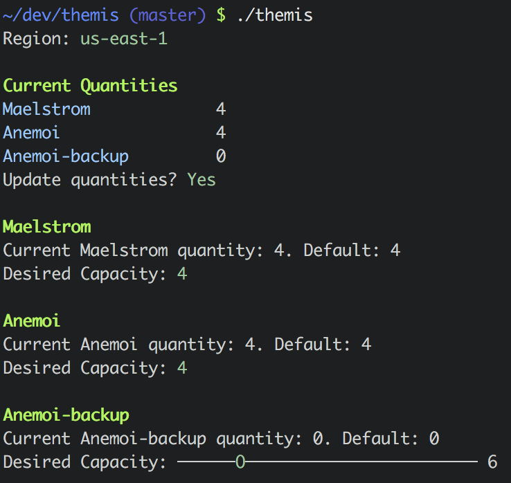

Themis is a CLI designed to provide a quick and simple way of adjusting the desired capacity of your AWS auto-scaling groups without needing to go into the web console.

It uses v2 of the AWS Ruby SDK.

After cloning:
1. run `bundle install`.
2. Update the config.yml with the regions and autoscaling group names unique to your infrastructure.

To run the script:
```./themis```

Sample output:
<!--  -->

<p align="center">
  
</p>
